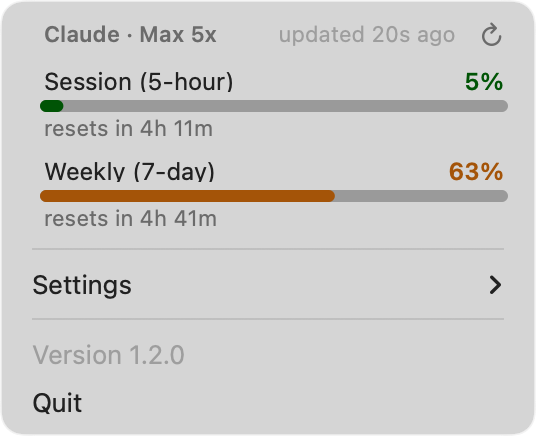

# Claude Usage



A macOS menu-bar app for Claude Code: how much of your plan is left, when it
resets, and which agents are running. Built on
[StatusItemKit](https://github.com/nicholaspsmith/StatusItemKit).

The icon tracks the **5-hour session limit** — the one that actually stops your
work. Pick its shape and colour under menu ▸ Icon: **Arc**, **Gauge**, **Pie**
or **Wedge**, in any of seven presets or a custom colour from the macOS colour
picker. Every shape shows a proportion, because that is the icon's whole job;
the weekly window is the slower one and lives in the menu rather than competing
for the single glyph.

Your colour is the **resting** colour. The bar still goes orange at 50% and red
at 80% — that escalation is the warning, and a meter that looks the same at 5%
and 95% has stopped saying the thing you opened it for.

## Install

Part of the [macOS Dev Environment
Setup](https://github.com/nicholaspsmith/MacOS-Dev-Environment-Setup) suite —
`./bootstrap.sh --all` installs it along with everything else. To install it on
its own:

```bash
git clone https://github.com/nicholaspsmith/StatusItemKit.git ~/Code/StatusItemKit
git clone https://github.com/nicholaspsmith/claude-usage-menubar.git ~/Code/claude-usage-menubar
cd ~/Code/claude-usage-menubar && ./install.sh
```

`StatusItemKit` must sit **beside** this repo — the package depends on it by
relative path (`../StatusItemKit`), so a clone somewhere else will not build.

`install.sh` builds the bundle, symlinks `~/Applications/Claude Usage.app` to
`build/`, registers Start-at-Login, stops any running copy, and launches the new
one. Re-run it to update; it is safe to run repeatedly.

**Requires** macOS 13+, Xcode Command Line Tools, and Claude Code signed in
(`claude auth status` should report `loggedIn: true`).

## What the menu shows

| Section | Source |
|---|---|
| Plan (`Max 20x`, `Pro`) and the 5-hour + 7-day allowances, with reset countdowns | Anthropic's OAuth usage endpoint |
| Running Claude Code sessions and whether each is busy | `~/.claude/sessions/*.json` |

## The Keychain prompt

On first run macOS asks to read the `Claude Code-credentials` Keychain item.
That item holds the OAuth token, and the token's only destination is the
`Authorization` header of the usage probe — nothing else from the credential
store reaches the UI except the plan name. Choose **Always Allow** to stop the
prompt recurring.

Deny it and the limits section reads "Not signed in"; token counts and session
state keep working, because those come from local files.

If limits read **"Sign-in expired"**, start Claude Code. Only the CLI can mint a
fresh token — this app can only read the one the CLI leaves behind.

## Notes on the numbers

## Development

```bash
swift build
swift test
```

`ClaudeUsageCore` holds the parsing and aggregation and has no AppKit
dependency, so all of it is unit-testable; the app target is the menu and icon.

## License

MIT
