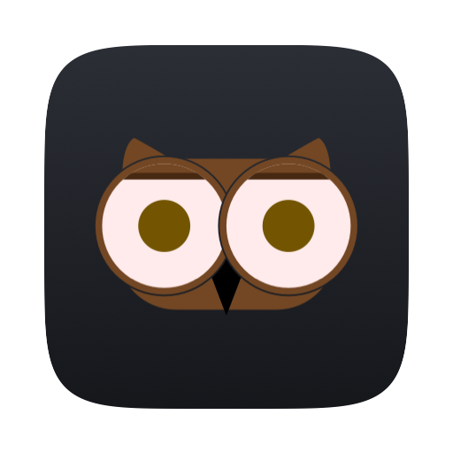
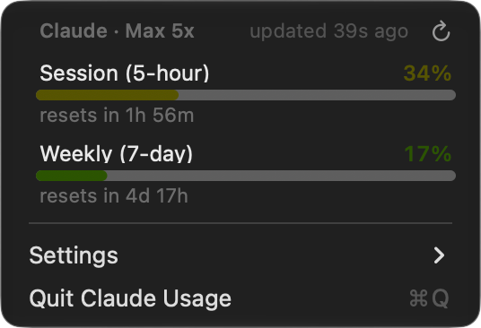

# Claude Usage

<p align="center"></p>

<p align="center">Part of <strong><a href="https://menumon.nicksmith.software">Menumon</a></strong>.</p>

<p align="center"></p>



A macOS menu-bar app for Claude Code: how much of your plan is left, when it
resets, and which agents are running. Built on
[StatusItemKit](https://github.com/nicholaspsmith/StatusItemKit).

## The menu-bar icon


The icon is Archimedes, an owl:

- **Eyelids** — the 5-hour session window. Open at 0%, half closed at 50%,
  shut at 100%.
- **Whites of the eyes** — the 7-day weekly window. They turn a deepening pink
  past 25% used, and red veins fade in over the last quarter.
- **Pupils** — also the weekly window: dark green (`#005401`) at 0%, reddening
  to orange-red (`#FF5401`) at 100%.

Shut eyes with red pupils means both limits are spent. The bars in the menu use
the same green-to-red ramp, each by its own percentage, so the weekly bar
matches the pupils. The colours are fixed; there is no colour setting.

Once a minute the owl blinks (550 ms). When several Menumon mascots are
running they take turns, a second apart: Archimedes (Claude Usage), Menu Pimp
(Mac Daddy), Carol (SoundChain), Iguanamous (VPN & DNS), then Armonitor
(Monitor Lizard), counting only the ones that are running. The blink is
skipped when Reduce Motion is on.

Settings ▸ Icon also offers plain meters — **Arc**, **Gauge**, **Pie** and
**Wedge**. These show the session window only, coloured from cyan at 0%
through blue and magenta to red at 100%.

## Install

Part of the [macOS Dev Environment
Setup](https://github.com/nicholaspsmith/MacOS-Dev-Environment-Setup) suite —
`./bootstrap.sh --all` installs it along with everything else. To install it on
its own:

```bash
git clone https://github.com/nicholaspsmith/StatusItemKit.git ~/Code/StatusItemKit
git clone https://github.com/nicholaspsmith/claude-usage-menubar.git ~/Code/claude-usage-menubar
cd ~/Code/claude-usage-menubar && ./install.sh
```

`StatusItemKit` must sit **beside** this repo: the package depends on it by
relative path (`../StatusItemKit`).

`install.sh` builds the bundle, symlinks `~/Applications/Claude Usage.app` to
`build/`, offers to turn on Start at Login (when run in a terminal), quits any
running copy and launches the new one. Re-run it to update.

**Requires** macOS 13+ and Xcode Command Line Tools, plus a Claude login:
either Claude Code signed in (`claude auth status` reports `loggedIn: true`)
or the app's own sign-in (below).

### Start at Login

Toggle it from Settings in the menu, or from the shell:

```sh
"$HOME/Applications/Claude Usage.app/Contents/MacOS/ClaudeUsage" --login on       # or: off, status
```

Start at Login is `SMAppService.mainApp`, which can only register the calling
process's own bundle, so the command must be the *installed* binary. A bare
`--login`, or `--login status`, only reports the current state.

## What the menu shows

| Section | Source |
|---|---|
| Plan (`Max 20x`, `Pro`) and the 5-hour and 7-day allowances, with reset countdowns | Anthropic's OAuth usage endpoint, polled every 60 s |
| Running Claude Code sessions and whether each is busy (off by default; Settings ▸ **Show Sessions**) | `~/.claude/sessions/*.json` |

## Signing in

The app uses Claude Code's login when there is one. Otherwise — or when it
has lapsed — **Sign In with Claude…** (under Settings, or at the top of the
menu when the numbers are missing) runs the same claude.ai OAuth flow Claude
Code uses: the browser opens on the consent page, the app receives the code on
a localhost port, exchanges it for tokens, and reads the plan from the profile
endpoint. It requests the `user:profile` scope only, which can read usage but
cannot run inference or create API keys.

That login belongs to the app. It is stored in its own Keychain item
(`Claude Usage-credentials`), refreshed by the app ten minutes before it
expires, and preferred over Claude Code's when both exist. The app never
writes or refreshes Claude Code's credential: refresh tokens rotate, so
refreshing it would sign Claude Code out. **Sign Out of Claude Usage** deletes
the app's own login and falls back to Claude Code's.

The flow uses Claude Code's OAuth client id, as other community tooling does;
Anthropic could change or restrict it.

## The Keychain

Claude Code's token lives in the `Claude Code-credentials` Keychain item. The
app sends it only in the `Authorization` header of the usage request; the plan
name is the only other part of the credential shown in the UI.

Both Keychain items are read and written by running `/usr/bin/security`
rather than through the Security framework. The app is signed with a local
identity that has no Team ID, so macOS records it in the item's partition list
by CDHash. Every time Claude Code saves a refreshed token (`security
add-generic-password -U`) that list is rebuilt and the app's entry is dropped,
so a direct Keychain read would prompt for the login password about every
twelve hours, and again after every rebuild. `/usr/bin/security` sits in the
`apple-tool:` partition, which survives the rebuild, so it never prompts. A
successful read is cached in memory until the token nears expiry, so the
Keychain is read once per token, not once per poll.

If the read fails, the limits section says why ("Claude Code not signed in on
this Mac", "Keychain locked", "Keychain access denied"). The sessions section
keeps working, because it reads local files.

If the limits read **"Sign-in expired"**, start Claude Code (which refreshes
its own token) or use **Sign In with Claude…** to give the app a login it
refreshes itself.

## Development

```bash
swift build
swift test
scripts/build-app.sh    # builds build/Claude Usage.app
```

`ClaudeUsageCore` holds the parsing, OAuth and credential logic and has no
AppKit dependency, so it is fully unit-testable; the `ClaudeUsage` target is
the menu and icon.

## Releasing

Every push to `main` is a release. Before pushing, add a dated
`## [X.Y.Z] - YYYY-MM-DD` section to the top of [`CHANGELOG.md`](CHANGELOG.md)
(minor for features, patch for fixes; turn a waiting `## [Unreleased]` into
it). When it reaches `main`, GitHub tags `vX.Y.Z` and publishes the section as
a release titled `vX.Y.Z`. Without a new version:

- a push is refused locally by the `pre-push` hook;
- a pull request **cannot merge** — `release / check` is required on `main`;
- a push that reaches `main` anyway fails the release workflow.

The one exception is `[no release]` in the tip commit's message, for changes
nothing a user runs (setup, CI, developer docs): it passes every check with no
version bump and no tag. Never tag or create a release by hand, and never
`gh pr merge --admin` past a failing check — fix the PR. After merging, `git pull` for the tag and rebuild. `install.sh` re-arms the hook on a fresh clone.
See [StatusItemKit — Releases](https://github.com/nicholaspsmith/StatusItemKit#releases-every-push-is-one) for the whole rule.

## License

Copyright (c) 2026 Nicholas Smith. Licensed under the
[Mozilla Public License 2.0](LICENSE). You may use, modify, sell and
redistribute this software, including inside proprietary products, provided
the copyright notice and license stay on these files and any modified
versions of them are made available under the same license.

## The menu-bar suite

Part of a suite of macOS menu-bar apps that share one framework, one
build-and-sign script, and one installer. They are designed to sit in the
same bar together: consistent menus, a common **Icon** picker for shape and
colour, and cooperative hiding so no icon strands another.

| App | What it does |
|---|---|
| **Claude Usage** | Claude Code plan limits, resets, and live agent sessions |
| [Apollo Monitor](https://github.com/nicholaspsmith/apollo-monitor-menubar) | Apollo audio-interface monitor level |
| [Battery Time](https://github.com/nicholaspsmith/battery-time-menubar) | Time remaining, power mode, and 24h usage |
| [VPN & DNS](https://github.com/nicholaspsmith/vpn-dns-menubar) | An iguana for Mullvad + Tailscale state, with a DNS watcher |
| [Mac Daddy](https://github.com/nicholaspsmith/mac-daddy-menubar) | Kills media trackers, trashes stale downloads, reaps hung processes, watches the UA mixer engine, and sweats as your process count climbs |
| [KeyLight](https://github.com/nicholaspsmith/keylight-menubar) | Ctrl+brightness keys remapped to keyboard backlight |
| [Monitor Lizard](https://github.com/nicholaspsmith/monitor-lizard-menubar) | External-monitor brightness, contrast and resolution, Night Shift, and the built-in screen from dimmer than macOS allows to XDR |
| [Homestead](https://github.com/nicholaspsmith/home-assistant-menubar) | Home Assistant dashboards and device controls in the menu |
| [SoundChain](https://github.com/nicholaspsmith/soundchain-menubar) | One chain of Audio Unit effects over all system audio |
| [Menu Crane](https://github.com/nicholaspsmith/menu-crane) | A ⌘Space launcher for apps, arithmetic, unit conversions and emoji |
| [MacRecorder](https://github.com/nicholaspsmith/MacRecorder) | Screen recording with system audio |
| [Barn](https://github.com/nicholaspsmith/menubar-barn) | macOS 26 and earlier only: hides a block of status icons by width (on macOS 27, use System Settings ▸ Menu Bar) |

| Framework | |
|---|---|
| [StatusItemKit](https://github.com/nicholaspsmith/StatusItemKit) | Status-item lifecycle, polling, menus, meter and mascot icons, the shared Icon picker |
| [HotkeyKit](https://github.com/nicholaspsmith/HotkeyKit) | CGEventTap engine for intercepting and remapping global keys |

Install the whole suite on a fresh Mac with
[macOS Dev Environment Setup](https://github.com/nicholaspsmith/MacOS-Dev-Environment-Setup):

```bash
git clone https://github.com/nicholaspsmith/MacOS-Dev-Environment-Setup.git
cd MacOS-Dev-Environment-Setup && ./bootstrap.sh --all
```
